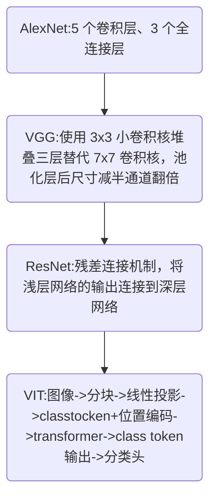
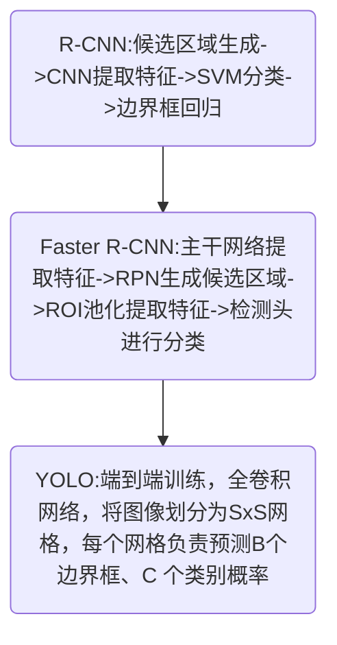
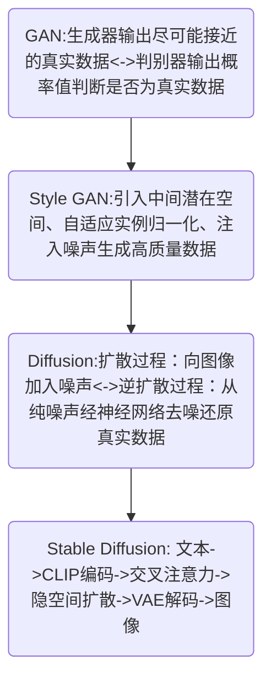
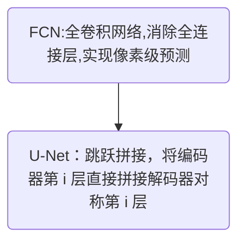

# 一、模型架构进化之路
## 1.1 图像分类领域模型架构演进

**趋势**：提升深度，转向 transformer。
## 1.2 目标检测领域模型架构演进

**趋势**：多阶段候选框->端到端单阶段检测->锚框机制优化。
## 1.3 图像生成领域模型架构演进

趋势：判别器-生成器对抗->风格解耦->扩散建模->潜在空间扩散。
## 1.4 图像语义分割领域模型架构演进

趋势：全连接层->全卷积网络->跳跃连接融合多尺度特征。
# 二、数据增强技术
| 阶段   | 技术演进                   | 模型              |
| ---- | ---------------------- | --------------- |
| 早期基础 | 旋转、裁剪、颜色抖动             | AlexNet         |
| 空间变形 | 弹性变形增强形变鲁棒性（尤其生物医学领域）  | U-Net           |
| 归一化  | 局部响应归一化(LRN)->批归一化(BN) | AlexNet->ResNet |
| 高级生成 | 使用生成模型合成训练数据           | StyleGAN/DDPM   |
# 三、激活函数和正则化
| 技术      | 意义                        | 代表模型     |
| ------- | ------------------------- | -------- |
| ReLU    | 解决 Sigmoid/Tanh 梯度消失，加速收敛 | AlexNet  |
| Dropout | 在全连接层随机失活，抑制过拟合           | AlexNet  |
| AdaIN   | 自适应实例归一化，实现风格注入           | StyleGAN |

# 四、损失函数优化
| 问题场景   | 解决方案                                    | 代表模型  |
| ------ | --------------------------------------- | ----- |
| 目标检测定位 | 平方误差->IOU 责任分配(平衡大小框误差)                 | YOLO  |
| 类别不平衡  | 加权损失函数(强调边界像素和稀有类别)                     | U-Net |
| 生成对抗训练 | 原始 GAN 损失->Wasserstein 举例/LSGAN（解决梯度消失） | 后续改进  |
| 扩散模型   | 变分下界优化->噪声预测均方误差                        | DDPM  |
